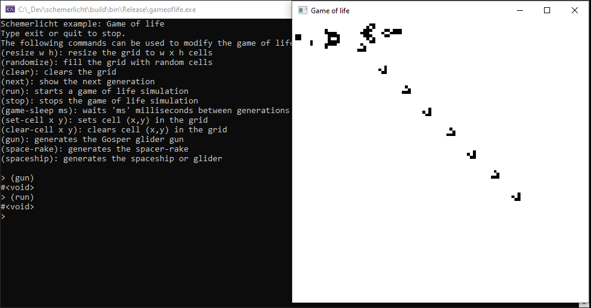

# schemerlicht
Scheme interpreter in c

Introduction
------------

Schemerlicht is a bytecode interpreter for the language Scheme. I based myself on the excellent paper ["The implementation of Lua 5.0"](https://www.lua.org/doc/jucs05.pdf) for developping the virtual machine.

Building the compiler
---------------------

The compiler has been tested on Windows 10 using Visual Studio 2019, on Ubuntu 20.10 with gcc 10.3.0, and on MacOS 12.3.1 with XCode 13.4.1.

A solution file / makefile can be generated with CMake. Use Visual Studio, make, or XCode to build the code.

When running the schemerlicht repl (e.g. via the "sl.exe" or "./sl" executable program that you've just built) the compiler will still need to build some basic functionality. This functionality is written in Scheme, and the code resides in the scm folder. The CMake variable SCHEMERLICHT_MODULES_PATH should point to this folder or to a local copy of this folder stored somewhere on your disk.

Using the compiler as a stand-alone repl
----------------------------------------

A repl can be started by running the `sl` program. 

Simply type your Scheme code here and get immediate feedback.
Any Scheme code you type is compiled to bytecode and run. 

A very basic module system is implemented that allows you to import additional functionality. Essentially it is a stripped version of the module system of [Chibi scheme](https://github.com/ashinn/chibi-scheme). For the implementation, see modules.c.
The module system allows to import additional functionality, e.g.:

    > (import 'csv)       ;; functionality for reading and writing comma separated value files
  
    > (import 'srfi-1)    ;; load srfi 1 functionality.
  
    > (import 'test-r4rs) ;; run unit tests for r4rs functionality (written by [Aubrey Jaffer](http://people.csail.mit.edu/jaffer/))
  
    ...
  
See scm/packages.scm for the currently defined modules. You can always add your own modules here.

Integration with slib
---------------------
I've been working to integrate schemerlicht with [slib](http://people.csail.mit.edu/jaffer/SLIB). There are still issues probably but some slib functionality can be used. First you'll have to install slib. Unpack the slib distribution to your folder of liking and make an environment variable `SCHEME_LIBRARY_PATH` that points to this folder. Then, start schemerlicht and type 

    > (import 'slib)
You should now be able to use the slib functionality.

Integrate schemerlicht as scripting language in your c++ program
----------------------------------------------------------------
In this section I'll explain how schemerlicht can be integrated in your c/c++ program by looking at the Game of Life example code that is in the repository.
Schemerlicht is designed as a library that you can include in your own project. You only have to include the schemerlicht_api.h header file and you're good to go.
I assume you are familiar with Conway's Game of Life, if not, take a look at the [Wikipedia page](https://en.wikipedia.org/wiki/Conway%27s_Game_of_Life). Essentially it is a cellular automaton with the following two rules:
-  If a cell is on and has either two or three neighbors that are on in the current generation, it stays on; otherwise, the cell turns off.
 - If a cell is off and has exactly three “on” neighbors in the current generation, it turns on; otherwise, it stays off. 
 
When you run the "gameoflife" project from the repository, you'll see that a repl is available in the console window, and one additional window is opened, representing the current state of the Game of Life grid. 

In the console window, type

    > (run)
to see the next generations. Similarly type

    > (stop)
to stop computing and visualizing new generations. If you want to turn a particular cell on or off, type

    > (set-cell 4 5)
or

    > (clear-cell 9 7)
Effectively schemerlicht has made our Game of Life programmable during execution. We can control the game by interacting with it via the repl.
